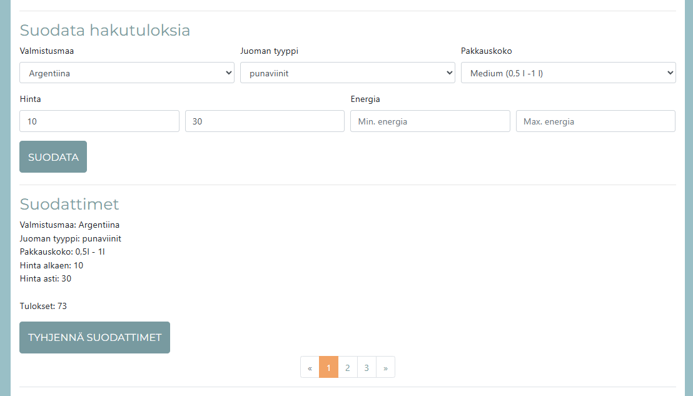

# Alko hinnasto

## AT00BX89-3010 Web ja peliteknologian perusteet

Tekijä: Kaisa Juhola

[Hinnasto](https://niisku.lab.fi/~tyynekaisa/alko/)

## Toiminnallisuudet

- Näytettävät sarakkeet: Numero, Valmistaja, Pullokoko, Hinta, Litrahinta, Tyyppi, Valmistusmaa, Vuosikerta, Alkoholi-%, Energia kcal/100ml
- Paginointi: Yhdellä sivulla 25 riviä
- Suodattimet: Valmistusmaa, juoman tyyppi, pakkauskoko, hinta(väli), energiamäärä(väli)
  - Yksi tai useampi kriteeri toimivat yhtä aikaa
  - Suodatustulosten lukumäärä kerrotaan
  - Suodattimet voidaan nollata painikkeesta
- Hinnasto haetaan Alkon datasta, mikäli data-kansio on tyhjä tai edellinen haettu data on yli 24h vanha
- [Excel-tiedosto muutetaan csv-muotoon](helpers/excelToCsv.php) shuchkin/simplexlsx -kirjastoa hyödyntäen.

## Datan lähde: alko.fi

[Alko excel-hinnasto](https://www.alko.fi/INTERSHOP/static/WFS/Alko-OnlineShop-Site/-/Alko-OnlineShop/fi_FI/Alkon%20Hinnasto%20Tekstitiedostona/alkon-hinnasto-tekstitiedostona.xlsx)
